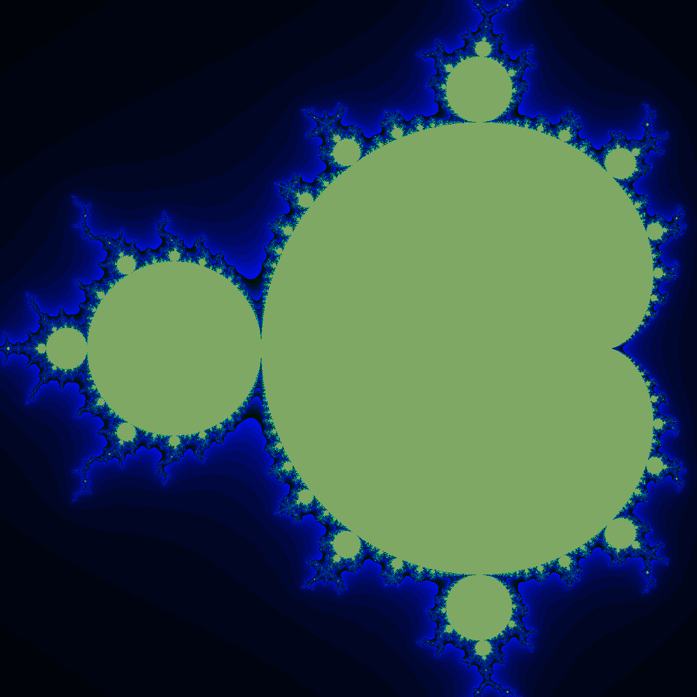

# A High-Performance Implementation of the Mandelbrot Set

Repository for the project in High-Performance Computing class 2021/22 

A parallel implementation of the “escape time” algorithm to produce drawings of the Mandelbrot Set.   
Application coded in C; parallel implementations in OpenMP, OpenMPI and CUDA.

## Overview

The aim of this project is to obtain a parallal and high performance implementation to generate images of the Mandelbrot Set.

OpenMP solution offers significant improvement in comparison to sequential implementation. 
In OpenMPI implementation processing is distributed within the different processors with MPI_Scatter and MPI_Gather functions.Every process is optimised with OpenMP pragmas.
CUDA implementation offers parallel solution run on the GPU. GPU used in providing the solution is NVIDIA GeForce GTX 1650.

## Description of this repository

- `code/`: source code for the application, from serial to shared and distributed memory parellel solutions as well as with CUDA
- `fractal-images/`: images generated with algorithms.
- `code/data/`: data used in sci paper
